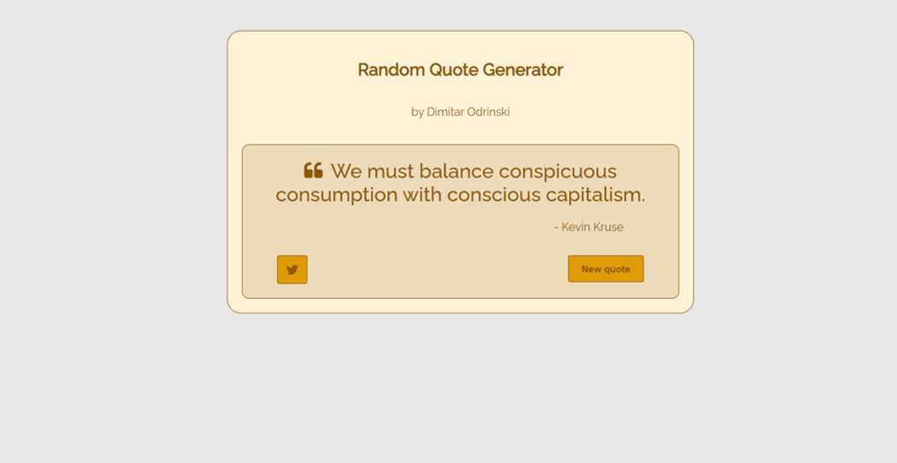
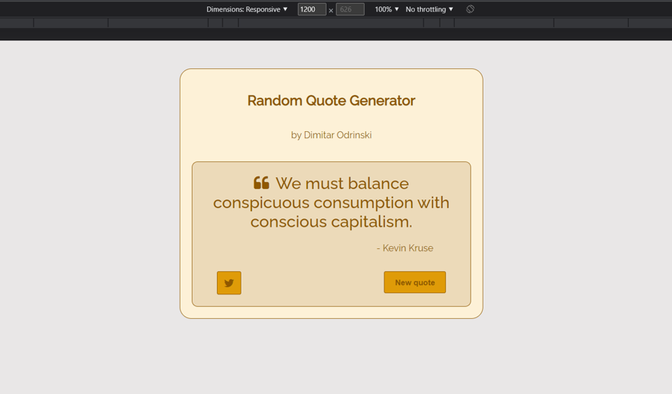

# Free Code Camp - Random Quote Machine

# The challenge

Your challenge is to build out Random Quote Machine.

Fulfill the user stories and get all of the tests to pass. Give it your own personal style.

You can use any mix of HTML, JavaScript, CSS, Bootstrap, SASS, React, Redux, and jQuery to complete this project. You should use a frontend framework (like React) because this section is about learning frontend frameworks. Additional technologies not listed above are not recommended and using them is at your own risk. Happy coding!

# My Solution

## Random Quote Machine project has been realised with React JS Hooks (useState, useEffect) and fetching data from external source.

### Here are some previews of the project

## Desktop view -Fullscreen HD

## Tablet view - width - 1200px

## Tablet view - width - 750px

## Mobile view - width - 350px

